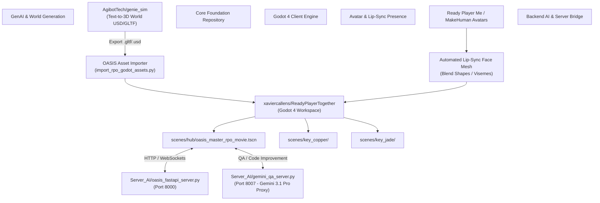

# OASIS Architecture Skill

This document specifies the master architecture of the **OASIS** virtual universe ecosystem, connecting Godot 4 3D client rendering with Python GenAI automation, FastAPI AI servers, avatar facial animation, and 3D world generation.

---

## 1. System Architecture Map



---

## 2. Architectural Pillars

### Pillar I: Core Foundation (`xaviercallens/ReadyPlayerTogether`)
- **Structure**: Scenes modularly partitioned into quest hubs:
  - `scenes/hub/`: Cyberpunk Oasis Central Hub, Showroom, Dojo.
  - `scenes/key_copper/`: Copper Key challenge environment & Tomb of Horrors.
  - `scenes/key_jade/`: Jade Key retro arcade / quest environment.
- **Automation Pipeline**: Python scripts (`build_*.py`, `add_*.py`) programmatically assemble `.tscn` scene files and attach GDScripts.

### Pillar II: Avatar & In-Person Presence (Godot VR/XR Avatar)
- **Avatars**: Ready Player Me (RPM) and MakeHuman mesh models (`Parzival`, `Art3mis`, `Aech`).
- **Facial Animation**: Uses automated lip-sync face meshes driven by audio viseme analysis (`use automated lip sync face mesh with visemes`).
- **Blend Shapes**: Morph targets for mouth shapes (`viseme_aa`, `viseme_E`, `viseme_I`, `viseme_O`, `viseme_U`, `viseme_PP`, `viseme_FF`, `viseme_TH`).

### Pillar III: 3D World Generation (`AgibotTech/genie_sim`)
- **3D World Pipeline**: Runs on host PC (`AgibotTech/genie_sim`) to convert prompt descriptions into persistent 3D USD or GLTF scenes.
- **Godot 4 Ingestion**: Imported into `assets/models/` and loaded dynamically or statically into scene nodes with collision shapes generated automatically (`CSGMesh3D` or `MeshInstance3D.create_trimesh_collision()`).

### Pillar IV: Communication Bridge & AI Services (`Server_AI`)
- **FastAPI Data Bridge**: `Server_AI/oasis_data_bridge_server.py` handles multi-client positional sync, inventory state, and key keycard validation.
- **Gemini QA Proxy**: `Server_AI/gemini_qa_server.py` runs an async queue worker dispatching review, unit test, and architecture requests to Vertex AI Gemini models.

---

## 3. GDScript State Machine & Component Pattern

To maintain clean architecture in GDScript, entities should be composed of lightweight components rather than monolithic scripts:

```gdscript
# res://scripts/components/state_machine.gd
class_name StateMachine
extends Node

@export var initial_state: State

var current_state: State
var states: Dictionary = {}

func _ready() -> void:
	for child in get_children():
		if child is State:
			states[child.name.to_lower()] = child
			child.Transitioned.connect(on_child_transition)
	
	if initial_state:
		initial_state.enter()
		current_state = initial_state

func _process(delta: float) -> void:
	if current_state:
		current_state.update(delta)

func _physics_process(delta: float) -> void:
	if current_state:
		current_state.physics_update(delta)

func on_child_transition(state: State, new_state_name: String) -> void:
	if state != current_state:
		return
	
	var new_state: State = states.get(new_state_name.to_lower())
	if not new_state:
		return
		
	if current_state:
		current_state.exit()
		
	new_state.enter()
	current_state = new_state
```
