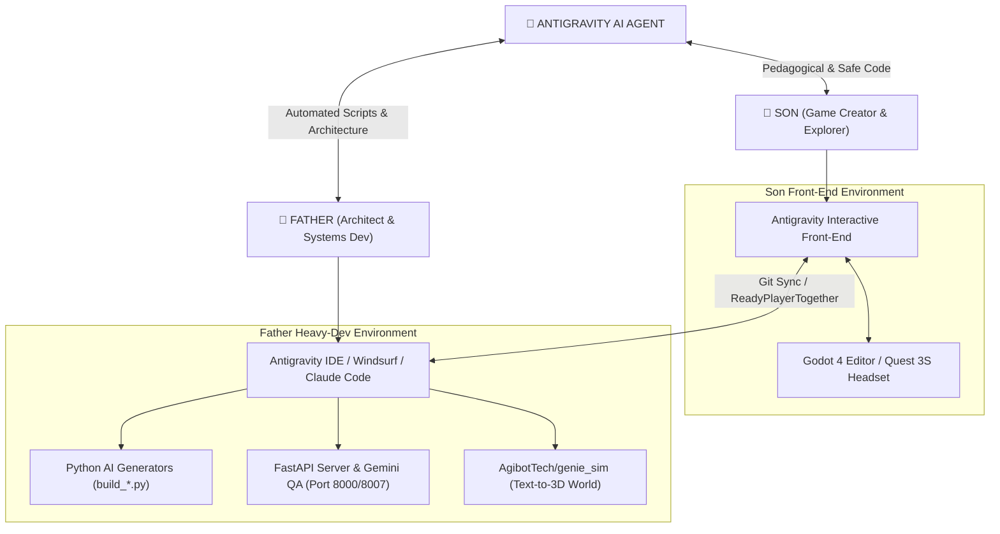

# 🕶️ OASIS Master Modus Operandi & Dual-Developer Setup

Welcome to the official operational blueprint for **Projet OASIS VR** (`xaviercallens/ReadyPlayerTogether`). This guide defines how Father and Son collaborate seamlessly using **Google Antigravity**, **Windsurf**, **Claude Code**, and the **Godot 4 Engine**.

---

## 1. Collaboration Roles & Tooling Matrix



| Dimension | 👦 Son (Game Creator) | 👨 Father (Architect) |
|---|---|---|
| **Primary Front-End** | **Google Antigravity Chat** + **Godot 4 Editor** | **Antigravity IDE** / **Windsurf** / **Claude Code** |
| **Focus Area** | Gameplay ideas, quest mechanics, avatar customization, playtesting | Python AI automation, backend FastAPI APIs, 3D world pipeline, refactoring |
| **AI Agent Interaction** | Conversational, pedagogical, step-by-step guidance, safe code execution | High-speed script generation, batch error resolution, architectural review |
| **Output / Artifacts** | GDScript tweaks, scene playtesting, quest feedback | `build_*.py` generators, `Server_AI/`, USD/GLTF imports, GUT unit tests |

---

## 2. Son's Workflow Playbook (Antigravity Interactive Front-End)

When the son works on OASIS using Antigravity as his front-end assistant:

1. **Ideation & Feature Requests**:
   - Ask Antigravity in natural language: *"Antigravity, how do I add a new laser sword to the Cyberpunk Hub?"* or *"Can we make Parzival jump higher in the Copper Key quest?"*
2. **Interactive Code & Explanation**:
   - Antigravity provides clean, typed GDScript 2.0 code snippets, explaining how nodes, signals, and physics work step by step.
3. **Instant Testing in Godot 4**:
   - Open Godot 4 Editor or run `Launch_Oasis.bat` / `Launch_Oasis.ps1`.
   - Press **F5** (or play button) to test in Desktop mode (WASD) or don the **Meta Quest 3S** for full VR immersion.
4. **Quick Shortcuts in Game**:
   - `Shift + F`: Open text teleporter with autocomplete.
   - `L`: Showroom Gallery.
   - `Tab`: Master Controls Menu.
   - `1` to `9`: Jump immediately to test demos.

---

## 3. Father's Workflow Playbook (Antigravity IDE / Windsurf / Claude Code)

When the father works on backend architecture and heavy automation:

1. **Python Generator Pattern (`build_*.py`)**:
   - Run Python scripts to assemble complex scenes, assign shaders, or setup node trees programmatically without tedious manual UI drag-and-drop.
   ```powershell
   python build_cyberpunk_hub_and_rpm.py
   python add_parzival_npc.py
   ```
2. **Generative 3D Worlds (`AgibotTech/genie_sim`)**:
   - Generate prompt-based 3D assets to USD/GLTF on host PC.
   - Run `python import_rpo_godot_assets.py` to auto-ingest into Godot 4 `assets/models/`.
3. **Backend AI Services (`Server_AI`)**:
   - Run `python Server_AI/oasis_fastapi_server.py` (Port 8000).
   - Run `python Server_AI/gemini_qa_server.py` (Port 8007) for automated code reviews (`/api/qa/review`).
4. **Headless Engine Verification**:
   - Execute headless checks before committing to Git:
   ```powershell
   .\Godot4.exe --headless --script scripts/solve_all_node_warnings_and_errors.py
   ```

---

## 4. Shared Git & Synchronization Protocol

- **Target Repository**: `xaviercallens/ReadyPlayerTogether`
- **Branching Strategy**:
  - `main`: Stable release branch tested on Meta Quest 3S.
  - `feature/son-quest-updates`: Working branch for Son's gameplay features and scene edits.
  - `feature/father-ai-pipeline`: Working branch for Father's Python scripts and server backends.
- **Merge Hygiene**:
  - Always pull latest changes before starting a session (`git pull origin main`).
  - Run headless check before merging feature branches into `main`.

---

## 5. Antigravity Agent Directives for Dual Personas

When responding to prompts, **Antigravity AI Agent** automatically adapts its behavior:
- **Son Mode (Interactive / Learning)**:
  - Keep explanations concise, clear, and encouraging.
  - Use visual analogies for GDScript nodes, signals, and physics.
  - Provide direct file links and simple instructions for testing in Godot.
- **Father Mode (Architecture / Automation)**:
  - Focus on code efficiency, Python automation, API design, and system architecture.
  - Use batch tools (`write_to_file`, `replace_file_content`, `run_command`).
  - Maintain docstrings, static typing, and automated test coverage.
