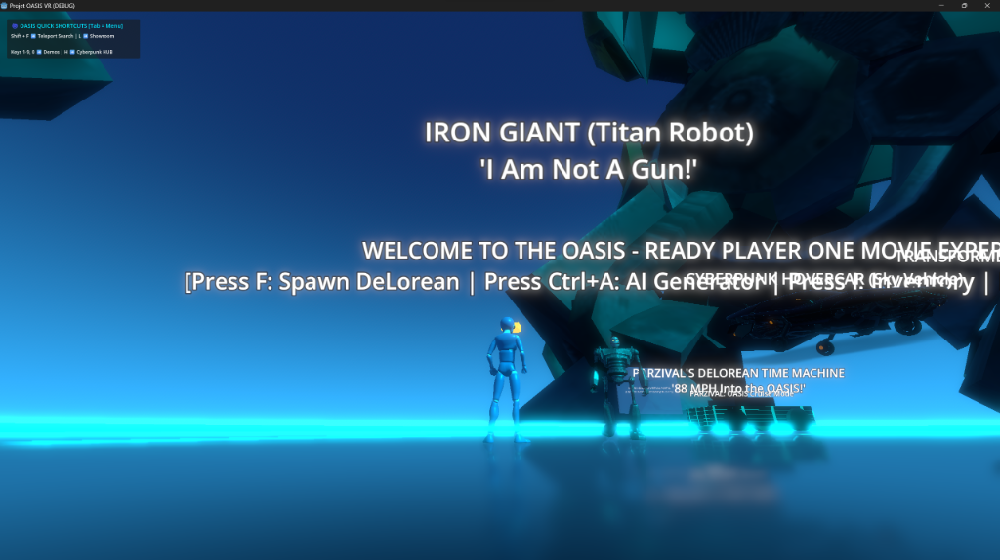

# 🌐 PROJET OASIS - Ready Player One VR & Desktop Metaverse



[](https://godotengine.org/)
[](LICENSE)
[](https://github.com/xaviercallens/ReadyPlayerTogether)
[](https://github.com/xaviercallens/ReadyPlayerTogether/releases/tag/v1.0.1)

> *"Welcome to the OASIS. It's a place where the bounds of reality are set only by your imagination."*

**Projet OASIS** (`xaviercallens/ReadyPlayerTogether`) is an open-source, next-generation VR & Desktop metaverse built on **Godot 4 Forward+**, **Jolt Physics**, and **AI-driven GenAI Pipelines**. Inspired by Steven Spielberg's *Ready Player One*, this project serves both as a father-son pair programming journey and a high-performance open-source platform for immersive VR/3D experiences.

---

## ✨ Features & Visual Highlights (Release v1.0.1)

### 🤖 Giant Titans & Battle Mechs
- **The Iron Giant (Titan Robot)**: Standing tall over the central plaza with glowing eyes and high-detail metallic PBR shader surfaces (*"I Am Not A Gun!"*).
- **Transformers Bumblebee (Titan Mech)**: Towering sci-fi mecha guarding the OASIS gateway with Forward+ neon reflections.
- **Godot 4 Battle Robot**: Fully rigged 3D battle robot stationed on the showcase platform.

### 🚗 DeLorean Time Machine & Vehicles
- **DeLorean Time Machine**: Dynamic hover vehicle featuring Jolt physics, wheel flipping, 88 MPH speed particle effects, and SAC Reinforcement Learning autonomous driving.
- **Cyberpunk Hovercar**: Flying vehicle floating majestically above the central plaza with neon thruster emissions.

### 👤 Parzival Playable Avatar (GDQuest 3D Mannequin)
- Playable third-person avatar equipped with a glowing **Gold VR Visor HUD**, **Cyan Arc Reactor Chestpiece**, dynamic camera orbit, and smooth spring-arm mechanics.

### 🔮 Legendary Artifacts & Portals
- **Orb of Osuvox**: Interactive protection spell artifact.
- **Zemeckis Cube**: Time-reversal puzzle cube.
- **Holy Hand Grenade**: High-explosive pop culture item.
- **Cyberpunk Hoverboard & Virtual Portal Screen**: Instant dimension warp portals.

---

## 🛠️ Tech Stack & Architecture

- **Engine**: Godot 4.7+ Forward+ (Vulkan 1.4, SSAO, SSR, Glowing Bloom Shader Pipeline).
- **Physics**: Godot Jolt Physics Engine for real-time 60fps Quest 3S & PC performance.
- **Avatar System**: Ready Player Me SDK & GDQuest 3D Mannequin integration with facial visemes and VR/XR controllers.
- **Asset Manager V2 (`scripts/tools/oasis_asset_manager.gd`)**:
  - **GLTFDocument Bypass**: Parses binary `.glb` assets directly from disk without editor hanging.
  - **Heuristic Auto-Scaling**: Automatically scales titan mechs (**x15**).
  - **Trimesh Collision Generation**: Automatically bakes physical hitboxes onto 3D surfaces.
  - **Cyberpunk PBR Shader Filter**: Enhances metallic reflections (`metallic >= 0.7`) and neon emissions.

---

## 🚀 Quick Start (Play in 1-Click)

### 1. Clone the Repository
```bash
git clone https://github.com/xaviercallens/ReadyPlayerTogether.git
cd ReadyPlayerTogether
```

### 2. Launch the Desktop Showcase Demo
Double-click **`Launch_Oasis_Desktop_Demo.bat`** (or execute via terminal):
```cmd
.\Launch_Oasis_Desktop_Demo.bat
```

### 🎮 Controls
- **WASD / Arrows**: Move Parzival
- **Mouse Orbit**: Rotate Camera View
- **Space / Gamepad A**: Jump
- **F / Gamepad Y**: Spawn DeLorean Time Machine
- **Shift + F**: Teleport Search Menu
- **L / Tab**: Showroom Gallery & Command Menu
- **Keys 1 to 9**: Instant Warp Demos

---

## 🤝 Join the OASIS Initiative! (Call for Contributors)

We are actively building the ultimate open-source metaverse platform and welcoming contributors from around the world!

We are looking for passionate creators in:
- 🎨 **3D Artists & Animators**: Blender / GLTF / USDZ modellers for mechs, avatars, sci-fi vehicles, and cyberpunk environments.
- 🕹️ **Godot 4 Developers**: GDScript 2.0, Forward+ shaders, UI/UX, and XR/VR controller mechanics.
- 🧠 **AI & ML Engineers**: PyTorch, Godot-RL agents, voice viseme lip-sync (RVC/Whisper), and ComfyUI 3D texture pipelines.
- 👓 **VR / XR Specialists**: Meta Quest 3/3S OpenXR hand-tracking, haptics, and spatial audio tuning.

### How to Contribute
1. Fork the repo and create your feature branch (`git checkout -b feature/AmazingOasisFeature`).
2. Commit your changes (`git commit -m 'feat: Add new OASIS Quest Scene'`).
3. Push to the branch (`git push origin feature/AmazingOasisFeature`).
4. Open a **Pull Request** — we review and merge quickly!

---

## 📜 Pedagogical Blueprint & Roles

- **Pilot (Son, 10yo)**: Level design, quest mechanics, 3D object placement, and playtesting.
- **Navigator (Father, ML Expert)**: System architecture, Godot 4 pipeline, Meta Quest VR builds, and GenAI backend servers.
- See [`OASIS_MODUS_OPERANDI.md`](OASIS_MODUS_OPERANDI.md) for our full father-son collaborative methodology.

---

## 📄 License

This project is open-source under the **MIT License**. Feel free to use, modify, and build your own worlds in the OASIS!
